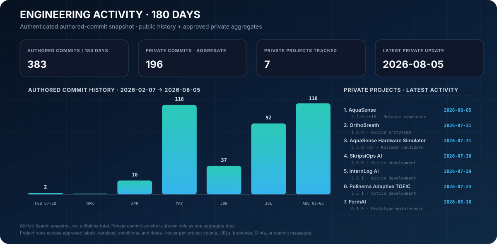

<!-- PROFILE-README:GENERATED -->
<!-- Edit portfolio/*.json, then run: python scripts/portfolio_ci.py update -->

  

<strong>Informatics Engineering student at Politeknik Negeri Malang building reliable full-stack systems, AI workflows, and on-premise IoT products</strong>

  <code>AI WORKFLOWS</code> ·
  <code>FULL-STACK SYSTEMS</code> ·
  <code>ON-PREMISE IOT</code> ·
  <code>SYSTEM INTEGRATION</code>

  <a href="https://ahmad-fadlih-portfolio.vercel.app">Portfolio</a> ·
  <a href="https://id.linkedin.com/in/ahmad-fadlih-wahyu-sardana-706933283">LinkedIn</a>

  <a href="#education">Education</a> ·
  <a href="#selected-engineering-work">Selected work</a> ·
  <a href="#currently-building">Currently building</a> ·
  <a href="#engineering-activity">Activity</a> ·
  <a href="#project-and-case-study-library">Project library</a> ·
  <a href="#contact">Contact</a>

> I turn complex operational flows into products with explicit states, validated outputs, observable failures, and practical documentation.

## Education

### [Politeknik Negeri Malang](https://jti.polinema.ac.id/) — State Polytechnic of Malang

**D-IV Informatics Engineering**  
Department of Information Technology · Malang, Indonesia · Current student

Developing practical experience in software engineering, applied AI, databases, full-stack systems, and system integration through coursework and independent engineering projects.

## Selected engineering work

### 1. AquaSense

**On-Premise IoT Operations · Private source · Sanitized case study**

**Problem**  
Water monitoring and relay control need a trusted local workflow where telemetry, device identity, commands, acknowledgements, and operator actions remain visible.

**Built**  
Designed a coarse-grained on-premise architecture that keeps device identity, telemetry, command acknowledgement, privileged access, and operational state explicit.

`Next.js` `React` `TypeScript` `MUI` `Go` `EMQX` `MQTTS` `Docker Compose`

**Evidence**

- Sanitized architecture and device-to-dashboard flow documented as a public case study
- Command lifecycle distinguishes request, delivery, acknowledgement, resulting state, and timeout
- Deployment and commissioning boundaries are stated instead of presented as completed production work

<strong>Engineering decisions, deep dives, and boundaries</strong>

**Deep-dive topics**

- Telemetry Ingestion and Device Identity Boundary
- Acknowledged Command and Configuration Workflow
- Coarse-Grained On-Premise Deployment

**Current boundaries**

- Release-candidate software still requires target-server validation, company PKI, firewall review, backup testing, and device commissioning.
- Relay coil voltage, socket, driver circuit, load behavior, and fail-safe wiring must be verified before hardware commissioning.

[Case study](case-studies/aquasense/README.md)

---

### 2. InternLog AI

**AI Workflow Product · Private source · Sanitized case study**

**Problem**  
Internship records are often scattered across daily notes, weekly reports, evidence files, and final-document requirements.

**Built**  
Built a traceable workflow where daily records become reviewed weekly outputs and AI suggestions remain optional, bounded, and user-approved.

`Next.js` `React` `TypeScript` `Firebase Auth` `Firestore` `Firebase Admin SDK` `Vitest`

**Evidence**

- Daily records remain the source of truth for downstream documents
- AI-assisted review is separated from factual records and requires user approval
- Document readiness exposes incomplete, stale, and blocked areas before export

<strong>Engineering decisions, deep dives, and boundaries</strong>

**Deep-dive topics**

- Daily Log to Weekly Logbook Lifecycle
- Controlled AI Mentor and Recommendation Flow
- Document Studio Readiness Audit

**Current boundaries**

- Multi-user support remains a limited beta rather than a commercial SaaS release.
- File evidence and larger document assets are still handled outside Firestore to stay within the intended free-tier architecture.

[Case study](case-studies/internlog-ai/README.md)

---

### 3. AI Content Strategy

**AI Decision System · Public source · Source-verifiable**

**Problem**  
Many AI content tools return one answer without making trade-offs or selection logic visible.

**Built**  
Implemented a typed Next.js and Gemini workflow with runtime guards, normalized result states, three strategy variants, scoring, recommendation, fallback behavior, and risk notes.

`Next.js 14` `TypeScript` `Tailwind CSS` `Gemini API` `Structured Output`

**Evidence**

- Public source is pinned to commit d3aedfd1dc8e76a29bf51a14fc12da4a77219de0 in the case-study evidence record
- Runtime type guards validate decision, previous-strategy, and legacy response shapes before rendering
- The API normalizes model output and exposes comparison, recommendation, execution, validation, and risk fields

<strong>Engineering decisions, deep dives, and boundaries</strong>

**Deep-dive topics**

- Structured Gemini Output Normalization
- Multi-Strategy Scoring Matrix
- Decision Recommendation and Trade-Off Reasoning

**Current boundaries**

- Model output still requires human judgment.
- Heuristic scoring is not a substitute for real campaign measurement.

[Repository](https://github.com/afadlih/AI-Content-Strategy---SEO-Assistant--Web-App-) · [Case study](case-studies/ai-content-strategy/README.md)

## Currently building

| Project | Current stage | Focus now |
| --- | --- | --- |
| [AquaSense](case-studies/aquasense/README.md) | `2.3.0-rc15` · Release candidate | Raspberry Pi 3B+ edge baseline, seven-container on-premise topology, provisioning safety, release hardening, and operator documentation. |
| [OrthoBreath](case-studies/orthobreath/README.md) | `1.8.0` · Active prototype | MQTT device topics, examination and breathing-session flows, Firebase mapping, PWA behavior, prototype safeguards, and regression coverage. |
| **SkripsiOps AI** | `4.0.0` · Active development | Personal thesis operations workspace with evidence traceability, readiness checks, defense export, workspace isolation, optional grounded RAG, and local Docker workflows. |

Versions are source-derived where configured. Development conditions describe the current engineering state and do not imply production readiness.

## Experience & recognition

- **PT Pindad (Persero) — Intern** (Current)  
  Working on software and system-integration tasks. Public descriptions remain NDA-safe and exclude internal infrastructure, credentials, and operational data.
- **PKM-KC 2026 Funding Recipient — OrthoBreath**  
  Full-stack contributor to a five-student health-tech prototype covering application flow, device-related work, testing support, and project communication. No clinical-readiness claim is made.

## Engineering approach

**01.** Keep deterministic rules separate from AI fallback.

**02.** Validate external and generated data before it reaches the UI or execution path.

**03.** Represent pending, failed, blocked, and completed states explicitly.

**04.** Document limitations and deployment boundaries as carefully as features.

**05.** Prefer evidence that can be inspected over decorative claims.

## Engineering activity

  

**Private work aggregate:** `196` authored commits across `7` approved projects in the rolling 180-day snapshot. This is context, not a project-quality score.

<strong>Private project version and activity index</strong>

| Project | Version | Condition | Latest activity |
| --- | :---: | --- | :---: |
| **AquaSense** | `2.3.0-rc15` | Release candidate | `2026-08-05` |
| **OrthoBreath** | `1.8.0` | Active prototype | `2026-07-31` |
| **AquaSense Hardware Simulator** | `2.3.0-rc5` | Release candidate | `2026-07-31` |
| **SkripsiOps AI** | `4.0.0` | Active development | `2026-07-30` |
| **InternLog AI** | `2.8.1` | Active development | `2026-07-29` |
| **Polinema Adaptive TOEIC** | `2.3.1` | Active development | `2026-07-23` |
| **FormAI** | `0.1.0` | Prototype maintenance | `2026-05-10` |

The visualization covers authored commits indexed from 2026-02-07 through 2026-08-05. It is a bounded snapshot rather than a lifetime total, and private repository URLs, branches, SHAs, and commit messages are never published.

## Project and case-study library

| Project | Engineering scope | Availability |
| --- | --- | --- |
| **FormAI** | AI-assisted Google Form automation platform with form analysis, deterministic CSV mapping, AI fallback, validation, execution modes, and row-level diagnostics. | [Case study](case-studies/formai/README.md) |
| **Smart Clothesline IoT** | Realtime dashboard for sensor telemetry, clothesline state, automation rules, alerts, history, and operational diagnostics. | [Repository](https://github.com/afadlih/smart-clothesline-iot-system) · [Case study](case-studies/smart-clothesline/README.md) |
| **Polinema Adaptive TOEIC** | Responsive TOEIC micro-learning platform with institutional roles, research cohorts, content workflows, assessments, deterministic mastery updates, and research exports. | [Case study](case-studies/polinema-adaptive-toeic/README.md) |
| **OrthoBreath** | Prototype dashboard for child profiles, dental capture, breathing-session monitoring, scan history, notifications, and combined reporting. | [Case study](case-studies/orthobreath/README.md) |
| **AquaSense Hardware Simulator** | Standalone Wokwi and ESP32 simulation, MQTT bridge behavior, firmware workflow, and telemetry readiness. | Public-safe overview |
| **SkripsiOps AI** | Evidence-first thesis operations, workspace isolation, readiness checks, defense export, optional grounded RAG, and tests. | Public-safe overview |

<strong>Recently updated public repositories</strong>

<!-- PROFILE-ACTIVITY:START -->
| Repository | Last public update | Language |
| --- | --- | --- |
| [GitHub Profile System](https://github.com/afadlih/afadlih) | 2026-08-10 | Python |
| [Ahmad Fadlih Portfolio](https://github.com/afadlih/Ahmad-Fadlih-Portfolio) | 2026-08-05 | TypeScript |
| [Smart Clothesline IoT](https://github.com/afadlih/smart-clothesline-iot-system) | 2026-06-10 | TypeScript |
| [AI Content Strategy](https://github.com/afadlih/AI-Content-Strategy---SEO-Assistant--Web-App-) | 2026-04-27 | TypeScript |
| [Next.js Framework Practice](https://github.com/afadlih/Pemrograman_Berbasis_Framework_Semester_6) | 2026-04-16 | TypeScript |
<!-- PROFILE-ACTIVITY:END -->

## Contact

Open to internship, junior engineering, applied AI, full-stack, and system-integration opportunities.

[Portfolio](https://ahmad-fadlih-portfolio.vercel.app) · [LinkedIn](https://id.linkedin.com/in/ahmad-fadlih-wahyu-sardana-706933283)

Private projects are represented through one privacy-reviewed aggregate activity total and sanitized case studies, never repository links. The engineering activity snapshot uses a rolling 180-day GitHub Search window; it is not a lifetime contribution total. Commit counts provide activity context only; project quality is demonstrated through evidence, engineering decisions, and deep-dive case studies. New repositories are detected daily but remain in a review queue until their public presentation is explicitly approved. A professional public email is intentionally omitted until a durable address is configured.
