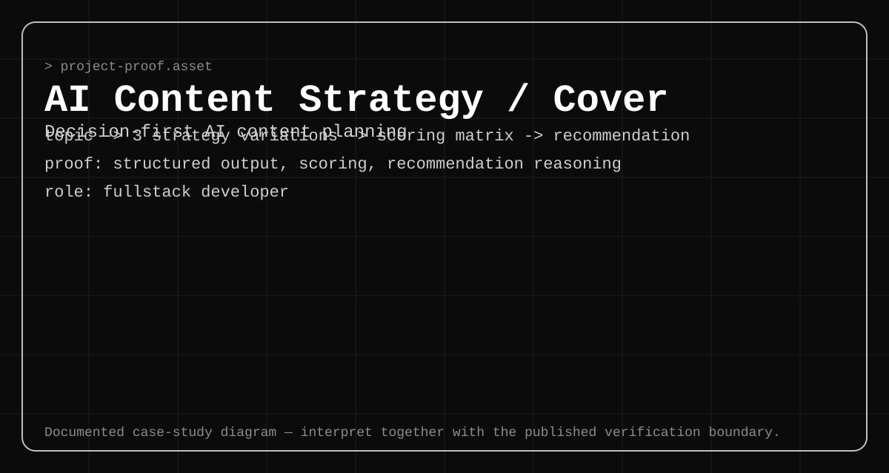

# AI Content Strategy — Source-Verifiable Decision System



## Context

This public Next.js project treats generative AI as a decision-support workflow rather than a single-answer caption generator.

**Role:** Fullstack Developer  
**Public evidence level:** `source-verifiable`

The evidence record is pinned to commit `d3aedfd1dc8e76a29bf51a14fc12da4a77219de0` so the published claims can be inspected against a stable source revision.

## Problem

A raw model response is too unstable for a reliable product interface. Users also need to compare strategy trade-offs instead of accepting the first generated answer.

## Workflow

```text
brief and constraints
  -> request validation
  -> multi-strategy generation
  -> runtime normalization
  -> comparison and recommendation
  -> execution guidance and risk notes
  -> stable result rendering
```

## Source-verified implementation

- Runtime guards distinguish decision, previous-strategy, and legacy result shapes.
- Three variation types—emotional, educational, and viral—are represented in the typed result model.
- Model output is normalized before it becomes UI state.
- The API response supports comparison, recommendation, optimized output, execution guidance, validation, and risk-related fields.
- Fallback handling preserves a readable result when model output is not valid structured JSON.

## Deep dives

1. [Structured Output Normalization](features/01-output-normalization.md)
2. [Multi-Strategy Scoring](features/02-multi-strategy-scoring.md)
3. [Recommendation and Trade-Off Reasoning](features/03-decision-recommendation.md)

## Evidence

- [Architecture diagram](assets/architecture.svg)
- [Workflow diagram](assets/workflow.svg)
- [Scoring model diagram](assets/scoring.svg)
- [Pinned source-verification record](evidence/source-verification.md)
- [Public repository](https://github.com/afadlih/AI-Content-Strategy---SEO-Assistant--Web-App-)

## Current boundaries

- Heuristic scores do not prove campaign performance.
- Model quality, prompt behavior, and external API availability still require human judgment and operational safeguards.
- The source review does not claim production adoption, revenue impact, or measured conversion lift.
