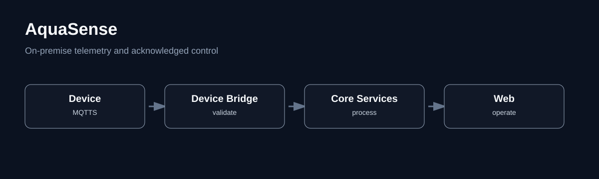

# AquaSense — On-Premise IoT Operations Case Study



## Context

AquaSense is a private on-premise IoT operations project for water telemetry, alarms, device provisioning, relay commands, configuration, audit records, and role-aware operator access.

**Role:** Fullstack and System Integration Developer  
**Public evidence level:** `documented-private`

The source and operational environment are private. This case study publishes only sanitized architecture, state transitions, trade-offs, limitations, and commissioning boundaries.

## Problem

An IoT control interface becomes unsafe when it treats a sent command as a completed physical action. Operators need to distinguish request creation, broker delivery, device acknowledgement, resulting state, failure, and timeout. The same principle applies to telemetry freshness, device identity, provisioning, and privileged access.

## System boundary

```text
Raspberry Pi / simulator
  -> MQTTS broker
  -> device bridge
  -> domain and access services
  -> web BFF
  -> role-aware operator interface
```

## Design decisions

- Device identity and topic validation belong at the MQTT boundary, not inside presentation code.
- A command remains pending until the expected device acknowledges it or the operation times out.
- Provisioning uses explicit lifecycle states instead of a single connected flag.
- Privileged access uses server-side role checks and MFA boundaries.
- Logical service separation is preserved while deployment is packaged into fewer on-premise containers.
- Hardware commissioning is blocked until relay coil voltage, socket, driver circuit, load, protection, and fail-safe behavior are verified.

## Deep dives

1. [Telemetry and Device Identity Boundary](features/01-telemetry-boundary.md)
2. [Acknowledged Command Workflow](features/02-command-acknowledgement.md)
3. [Coarse-Grained On-Premise Deployment](features/03-deployment.md)

## Evidence

- [Architecture diagram](assets/architecture.svg)
- [Operational workflow diagram](assets/workflow.svg)
- [Public verification boundary](evidence/verification-boundary.md)

## Current boundaries

- This profile does not claim production deployment, certification, field reliability, or completed industrial commissioning.
- Target-host validation, company PKI, firewall review, backup/restore testing, monitoring, and device commissioning remain environment-specific work.
- No internal hostnames, credentials, company network details, or private operational data are published.
