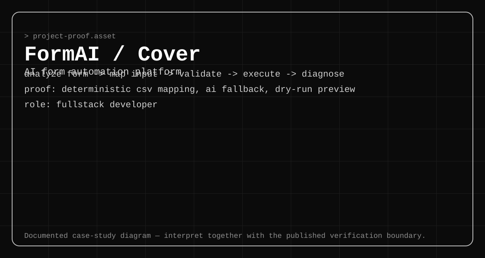

# FormAI — Safe Form Automation Workflow



## Project summary

FormAI is a private AI-assisted Google Form automation project. Its main engineering problem is not text generation; it is turning changing form structures and mixed answer sources into a reviewable execution plan before any submission occurs.

**Role:** Fullstack Developer  
**Public evidence level:** sanitized case study; source and production data remain private

## System boundary

```text
Form URL
  -> structure analysis
  -> normalized question model
  -> CSV/manual/rule mapping
  -> AI fallback for unresolved values
  -> validation and duplicate checks
  -> dry-run preview
  -> HTTP or browser execution
  -> row-level diagnostics
```

The workflow deliberately separates analysis, planning, and execution. An operator should be able to stop at preview, understand unresolved fields, and correct input before the system mutates an external form.

## Architecture decisions

- **Analyze first.** A raw form URL is not enough for safe automation. Questions, field types, required flags, options, and stable entry identifiers must be normalized first.
- **Deterministic values win.** Manual and CSV values take precedence over rules or AI-generated fallback.
- **Preview is a distinct state.** Validation and source tracing run before execution rather than being hidden inside it.
- **Execution modes are explicit.** Fast HTTP submission is useful where compatible; browser execution remains a controlled fallback for forms that need interactive behavior.
- **Diagnostics are row-level.** Failures should identify the respondent, field, source, and execution stage instead of returning a generic batch error.

## Deep dives

1. [Form Analyzer](features/01-form-analyzer.md)
2. [Deterministic CSV Mapping and AI Fallback](features/02-csv-ai-fallback.md)
3. [Dry-Run Preview and Diagnostics](features/03-dry-run-diagnostics.md)

## Case-study diagrams

- [Architecture](assets/architecture.svg)
- [Workflow](assets/workflow.svg)
- [Diagnostics model](assets/diagnostics.svg)

## Verification boundary

The public repository does not expose FormAI source, target forms, respondent records, credentials, or production screenshots. The case study documents design decisions and current limitations without presenting private implementation details as independently reproducible proof.

Read the complete boundary: [FormAI verification boundary](evidence/verification-boundary.md).

## Current limitations

- A form must be analyzed again when its structure changes.
- Label-based mapping can become ambiguous; stable entry identifiers are safer for strict automation.
- Some target forms still require browser execution instead of direct HTTP submission.
- AI fallback remains subordinate to validation and must not silently override explicit user data.
