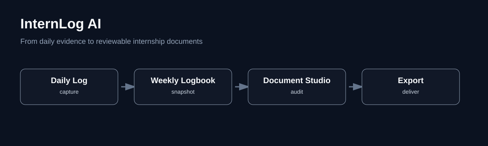

# InternLog AI — Internship Workflow Product Case Study



## Context

InternLog AI connects daily internship records, weekly logbooks, controlled AI review, document readiness, and export preparation in one workflow.

**Role:** Fullstack Developer  
**Public evidence level:** `documented-private`

The source and user records are private. The public case study therefore focuses on workflow design, data ownership, AI boundaries, document readiness, and known limitations.

## Problem

Internship documentation is often fragmented across notes, weekly summaries, evidence files, and final-report requirements. A generic chatbot can make the problem worse when it generates unsupported activities or hides missing data behind polished text.

## Workflow

```text
Daily factual record
  -> weekly grouping and review
  -> optional AI suggestion
  -> user approval
  -> document readiness checks
  -> preview and export preparation
```

## Design decisions

- Daily records remain the factual source of truth.
- Weekly outputs are derived from selected daily records rather than generated from an empty prompt.
- AI suggestions are optional, reviewable, and unable to replace factual ownership.
- Readiness checks separate missing, stale, blocked, and complete areas.
- Document generation is preceded by preview and validation.
- Free-tier architecture constraints are stated instead of hidden.

## Deep dives

1. [Daily-to-Weekly Logbook Lifecycle](features/01-logbook-lifecycle.md)
2. [Controlled AI Review](features/02-controlled-ai.md)
3. [Document Studio Readiness](features/03-document-studio.md)

## Evidence

- [Architecture diagram](assets/architecture.svg)
- [Workflow diagram](assets/workflow.svg)
- [Public verification boundary](evidence/verification-boundary.md)

## Current boundaries

- The profile does not claim public source availability, commercial SaaS readiness, user counts, or production performance.
- Larger files and evidence assets may require storage outside the primary document database.
- Multi-user behavior remains a limited beta boundary in the documented project state.
