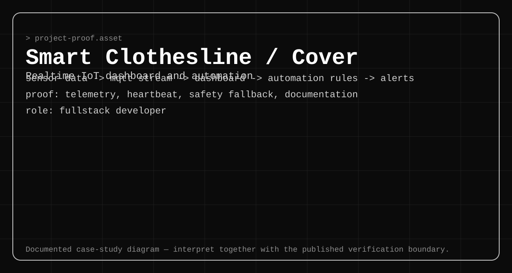

# Smart Clothesline IoT System — Realtime Operations Case Study



## Project summary

Smart Clothesline IoT System is a public realtime dashboard and device-integration project. It combines MQTT telemetry and commands, Firestore-backed operational records, Telegram notifications, historical analytics, and local safety behavior for an automated clothesline.

**Role:** Fullstack Developer  
**Public evidence level:** repository and source documentation are inspectable

## System boundary

```text
ESP32 + sensors
  <-> MQTT broker
  <-> Next.js dashboard
       -> Firestore history, events, alerts, configuration
       -> Telegram notification delivery
       -> historical batch analytics
```

Realtime control and historical analytics are deliberately separated. The device retains immediate rain fallback behavior so network or cloud failure does not become the only safety decision point.

## Engineering decisions

- MQTT topics are scoped by device identity for telemetry, status, commands, acknowledgements, and health.
- Dashboard commands are observable states rather than fire-and-forget UI actions.
- Heartbeat and freshness logic distinguish an actual safe state from a stale last-known value.
- Telegram is notification-only; it is not an alternate hardware control channel.
- Firestore stores sampled history and operational records, not the realtime motor-control loop.
- Historical batch processing remains outside the immediate control path.

## Deep dives

1. [MQTT Realtime Telemetry](features/01-mqtt-telemetry.md)
2. [Device Health and Heartbeat Monitoring](features/02-device-health.md)
3. [Automation Rules and Safety Fallback](features/03-safety-fallback.md)

## Case-study diagrams

- [Architecture](assets/architecture.svg)
- [Telemetry flow](assets/telemetry.svg)
- [Automation boundary](assets/automation.svg)

## Source verification

The public repository includes a maintained system-design document covering MQTT contracts, operational states, Firestore responsibilities, Telegram notification boundaries, error handling, and firmware safety fallback. The verification note pins those claims to a specific commit: [source verification](evidence/source-verification.md).

## Current limitations

- End-to-end reliability depends on broker, network, browser, and device health.
- Topic names documented as target contracts still require alignment with any older firmware or backend variants.
- Latency and reliability targets require measured staging or hardware tests; they are not inferred from architecture alone.
- Safety-critical commissioning still requires real device and actuator testing.
